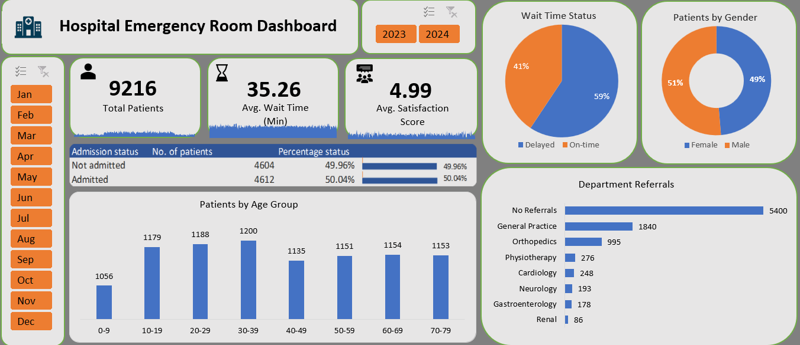

# Hospital Emergency Room Analysis

## Project Overview

This project analyzes Hospital Emergency Room patient data using Microsoft Excel to understand patient volume, waiting times, admission patterns, demographics, and department referrals.

An interactive dashboard was developed to provide a consolidated view of key emergency room performance metrics and enable analysis across different months and years.

## Project Objectives

The main objectives of this project are to:

- Analyze overall patient volume and emergency room activity.
- Evaluate patient waiting times and identify delays.
- Analyze patient admission patterns.
- Understand the demographic distribution of patients.
- Examine department referral patterns.
- Build an interactive Excel dashboard for monitoring key ER metrics.

## Data Cleaning and Transformation

The dataset was cleaned and transformed using Excel and Power Query. Key steps included:

- Correcting and standardizing data types.
- Converting admission date fields into proper date format.
- Converting admission time fields into proper time format.
- Handling missing and inconsistent values.
- Creating patient age groups for demographic analysis.
- Creating a wait-time status field to classify patients as **On-time** or **Delayed** based on a 30-minute threshold.
- Creating a calendar table to support date-based analysis.

## Key Performance Indicators (KPIs)

- **Total Patients:** 9,216
- **Average Wait Time:** 35.26 minutes
- **Average Satisfaction Score:** 4.99

> Note: The satisfaction score is calculated from available responses; some patient records contain missing satisfaction values.

## Dashboard

The dashboard includes interactive **Year and Month slicers**, allowing users to dynamically analyze ER performance for different periods.

## Key Insights

- A total of **9,216 patient visits** were analyzed.
- The average patient waiting time was **35.26 minutes**.
- **59% of patients** had waiting times greater than 30 minutes, while **41% were served within 30 minutes**.
- Admission outcomes were almost evenly distributed, with **50.04% admitted** and **49.96% not admitted**.
- Patient volume was relatively evenly distributed across most age groups, with the **30–39 age group recording the highest patient count**.
- **5,400 patients required no department referral**.
- Among patients requiring referrals, **General Practice** received the highest number, followed by **Orthopedics**.
- Gender distribution was nearly balanced, with **51% male and 49% female patients**.

## Tools and Techniques Used

- Microsoft Excel
- Power Query
- PivotTables
- PivotCharts
- Excel Formulas
- Slicers
- Conditional Formatting
- KPI Cards
- Data Cleaning and Transformation
- Dashboard Design

## Project Files

- `Hospital_Emergency_Room_Analysis.xlsx` — Complete Excel analysis and interactive dashboard.
- `hospital_er_dashboard.png` — Final dashboard preview.

## Dashboard Features

The dashboard enables users to analyze:

- Total patient visits
- Average waiting time
- Patient satisfaction
- Wait-time status
- Admission status
- Patient age distribution
- Gender distribution
- Department referrals
- Monthly and yearly performance

## Conclusion

The analysis provides a consolidated view of emergency room operations and highlights patient waiting time as an important area for operational attention. The dashboard enables interactive monitoring of patient volume, demographics, admission patterns, and referrals, supporting data-driven evaluation of ER performance.
